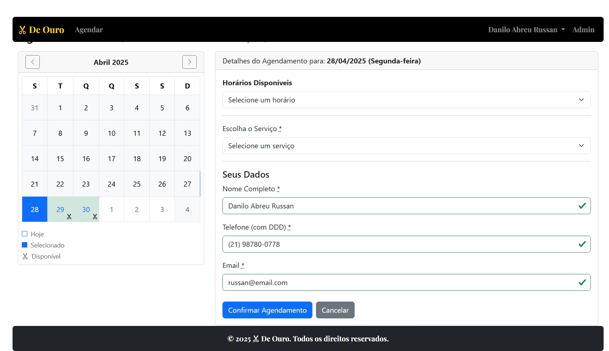
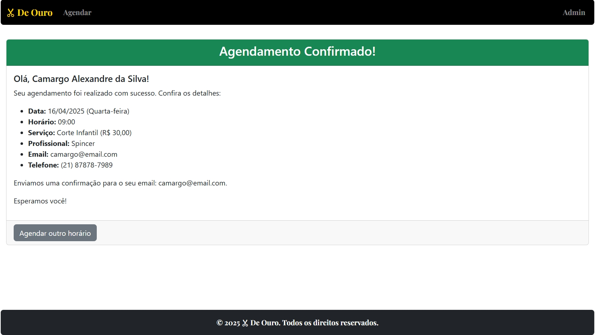
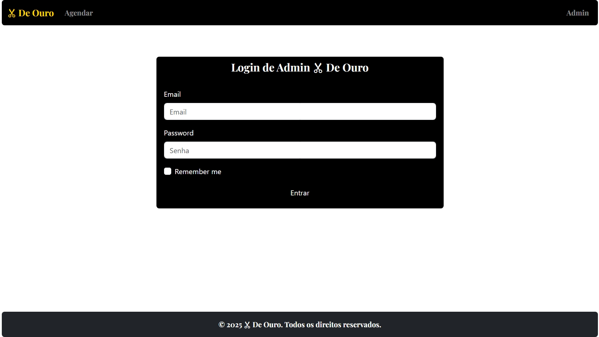
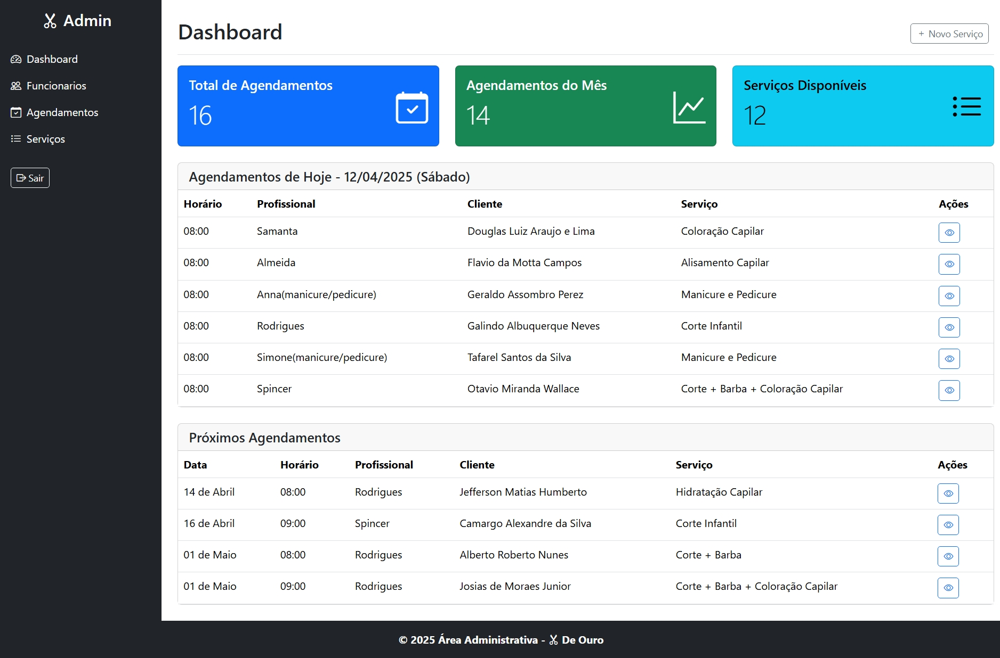
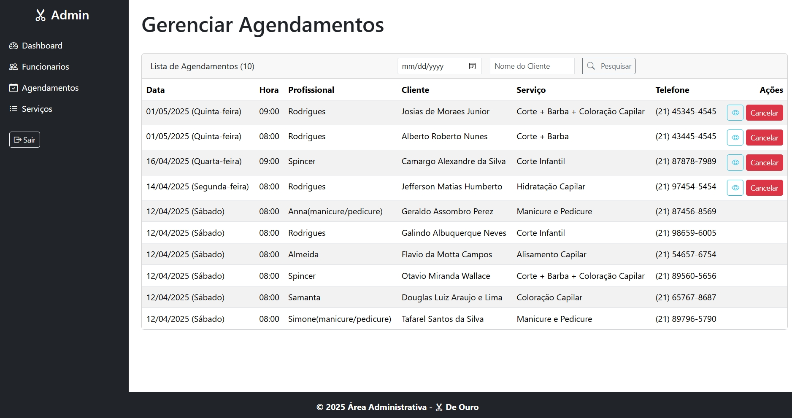
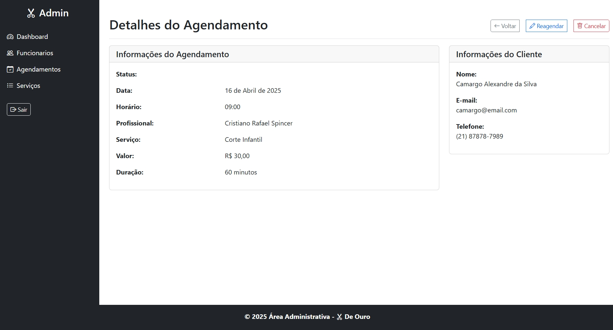
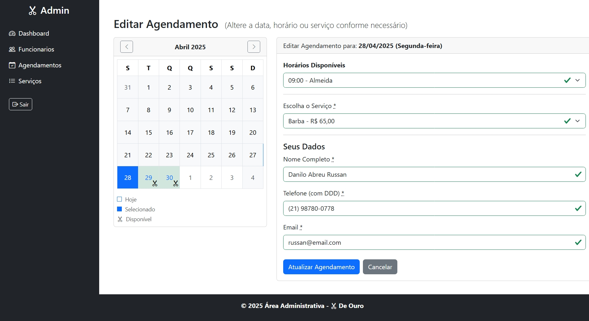

## Sistema de Agendamento para Barbearia 💈

O objetivo principal é oferecer uma interface moderna, reativa e eficiente tanto para clientes que desejam agendar um horário quanto para administradores que gerenciam os serviços, funcionários e agendamentos da barbearia.

## ✨ Objetivos do Projeto

- **Experiência do Cliente:** Facilitar o processo de agendamento online, permitindo que clientes escolham serviços, visualizem horários disponíveis em tempo real (considerando a disponibilidade de funcionários) e marquem seus compromissos de forma simples e rápida.
- **Gestão Administrativa:** Fornecer uma área segura e funcional para que os administradores da barbearia possam gerenciar os serviços oferecidos, **_cadastrar e gerenciar funcionários_**, visualizar, **_reagendar_** e cancelar os agendamentos existentes.
- **Tecnologia Moderna:** Utilizar Ruby on Rails 7 em conjunto com Hotwire (Turbo/Stimulus) para criar uma Single Page Application (SPA) _like experience_ com atualizações dinâmicas, minimizando recarregamentos de página e otimizando a performance.
- **Design Responsivo:** Garantir que a aplicação funcione e se adapte visualmente a diferentes tamanhos de tela (desktops, tablets, smartphones) utilizando o framework Bootstrap 5.3.3.

## 🚀 Funcionalidades Principais

### Para Clientes (Interface Pública)

- **Autenticação Segura:** Login/Logout para acesso à área do cliente (sem uso de Devise).
- **Cadastro Seguro:** Sign_up/Password_reset/Password_Forgot (sem uso de Devise)
- **Notificação por Email:** Envio automático de um email para confirmação de Sign_up/Password_Forgot.
- **Visualização de Serviços:** Lista dos serviços oferecidos pela barbearia.
- **Seleção de Data:** Calendário interativo para escolher a data desejada para o agendamento.
- **Visualização de Horários Disponíveis:** Exibição dinâmica dos horários vagos para a data e serviço selecionados. **_A disponibilidade considera tanto os horários de funcionamento quanto a disponibilidade dos funcionários para realizar o serviço naquele horário._**
- **Formulário de Agendamento:** Campos para informações do cliente (nome, email, telefone) logado e selecionar o serviço e horário desejado. **_(O sistema designa um funcionário disponível para o horário escolhido)_**.
- **Confirmação Instantânea:** Feedback imediato sobre o sucesso ou falha do agendamento.
- **Notificação por Email:** Envio automático de um email de confirmação após o agendamento bem-sucedido.
- **Gerenciamento de Agendamentos:**
  - Listar todos os agendamentos (com possibilidade de filtros por data).
  - Visualizar detalhes de um agendamento específico.
  - **_Reagendar agendamentos existentes:_**
    - **_Seleção de nova data/horário (futuro)._**
    - **_Verificação de disponibilidade (horário e funcionário)._**
    - **_Envio de notificação por email sobre o reagendamento._**
  - Excluir agendamentos.

### Para Administradores (Área Restrita)

- **Autenticação Segura:** Login/Logout para acesso à área administrativa (via Devise).
- **Dashboard:** Visão geral ou painel inicial da administração (pode incluir estatísticas futuras).
- **Gerenciamento de Serviços (CRUD):**
  - Listar todos os serviços.
  - Criar novos serviços (nome, duração, preço).
  - Editar serviços existentes.
  - Excluir serviços.
- **_Gerenciamento de Funcionários (CRUD):_**
  - **_Listar todos os funcionários._**
  - **_Criar novos funcionários (nome, etc.)._**
  - **_Editar funcionários existentes._**
  - **_Excluir funcionários._**
- **Gerenciamento de Agendamentos:**
  - Listar todos os agendamentos (com possibilidade de filtros por data, **_funcionário_**).
  - Visualizar detalhes de um agendamento específico (incluindo o funcionário designado).
  - **_Reagendar agendamentos existentes:_**
    - **_Seleção de nova data/horário (futuro)._**
    - **_Verificação de disponibilidade (horário e funcionário)._**
    - **_Envio de notificação por email ao cliente sobre o reagendamento._**
  - Excluir agendamentos.

## Algumas Views

### - Home Index


---

### - Agendamento Cliente



---

### - Confirmação Agendamento



---

### - Login Admin



---

### - Dashboard Admin



---

### - Lista Agendamentos



---

### - Detalhes Agendamento Admin



---

### - Reagendamento Admin



---

## ⚙️ Tecnologias Utilizadas

- **Backend:** Ruby 3.3.4, Ruby on Rails 7.2.2
- **Frontend:**
  - Hotwire (Turbo Drive, Turbo Frames, Turbo Streams)
  - Stimulus JS
  - Bootstrap 5.3.3 (via gem `bootstrap` ou `importmap`)
- **Banco de Dados:** PostgreSQL
- **Formulários:** Gem `simple_form`
- **Autenticação (Admin):** Gem `devise`
- **Envio de Emails:** Action Mailer
  - Desenvolvimento: `letter_opener_web`

## 📋 Regras de Negócio e Lógica

- **Serviços:**
  - Possuem nome, duração (em minutos) e preço.
  - Validações: Nome, duração e preço são obrigatórios. Duração e preço devem ser numéricos e positivos.
- **_Funcionários:_**
  - **_Possuem nome (e potencialmente outros dados)._**
  - **_São gerenciados apenas por administradores._**
  - **_São associados aos agendamentos._**
- **Agendamentos:**
  - Associados a um `Service` **_e a um `Employee`_**.
  - Contêm data/hora de início (`start_time`), nome, email e telefone do cliente.
  - A data/hora de fim (`end_time`) é calculada automaticamente (`start_time` + `service.duration`).
  - Validações: `start_time`, `client_name`, `client_email`, `client_phone`, `service_id`, **_`employee_id`_** são obrigatórios.
  - Validação de formato para `client_email`.
  - **Regra de Conflito:** Não é permitido agendar um horário se **_o funcionário designado_** já possui outro agendamento que conflita com o período (considerando `start_time` e `end_time`).
  - **Regra Temporal:**
    - Não é permitido agendar ou reagendar horários no passado.
    - Agendamento/Reagendamento no dia atual: só são permitidos horários anterior a hora atual.
    - Limite de agendamento futuro: máximo de 30 dias (data atual + 30 dias).
- **Disponibilidade de Horários:**
  - Calculada com base no horário de funcionamento da barbearia (ex: 8:00 às 18:00).
  - Considera a duração do serviço selecionado para gerar os slots possíveis.
  - Consulta os agendamentos já existentes no banco de dados para a data selecionada.
  - **_Verifica quais funcionários estão disponíveis para realizar o serviço selecionado naquele intervalo de tempo (considerando seus agendamentos existentes)._**
  - **_Um horário é considerado disponível se existir pelo menos um funcionário livre para atender durante todo o período do serviço naquele horário._**
  - Remove os horários já totalmente ocupados (sem funcionários disponíveis) da lista de slots.
  - Remove os horários anteriores à hora atual no dia corrente.
  - A lógica deve tratar corretamente fusos horários (Time Zones).
- **_Reagendamento (Admin):_**
  - **_Só pode ser realizado por administradores._**
  - **_A nova data/hora deve ser no futuro._**
  - **_A validação de disponibilidade (horário + funcionário) é aplicada ao novo horário escolhido._**
  - **_Um email de notificação é enviado ao cliente informando sobre a alteração._**
- **Administração:**
  - Acesso restrito a usuários autenticados via Devise (`AdminUser` model).
  - Inicialmente, qualquer usuário logado tem permissão de administrador.
- **Emails:**
  - Um email de confirmação é enviado ao cliente após um reagendamento bem-sucedido (`deliver_later`).
  - **_Um email de notificação é enviado ao cliente após um reagendamento bem-sucedido (`deliver_later`)._**

## 🏗️ Estrutura do Projeto (Visão Geral)

- **Models:** `Service`, `Appointment`, `AdminUser` (gerenciado pelo Devise), **_`Employee`_**.
- **Controllers:**
  - `AppointmentsController`: Ações `new`, `create` para clientes e `available_slots` para busca dinâmica de horários (**_lógica de disponibilidade atualizada_**).
  - `Admin::` Namespace para controllers da área administrativa:
    - `Admin::BaseController` (com autenticação)
    - `Admin::DashboardController`
    - `Admin::ServicesController` (CRUD)
    - **_`Admin::EmployeesController` (CRUD)_**
    - `Admin::AppointmentsController` (Index, Show, Edit, **_Update (para reagendamento)_**, Destroy)
- **Views:**
  - Layout padrão (`application.html.erb`) com Bootstrap.
  - Views para agendamento do cliente (`app/views/appointments/`).
  - Views para a área administrativa (`app/views/admin/...`).
  - Templates de Email (`app/views/appointment_mailer/`) **_(incluindo template para reagendamento)_**.
- **JavaScript:** Controllers Stimulus (`app/javascript/controllers/`) para interatividade (ex: calendário, seleção de slots).
- **Rotas:** Definidas em `config/routes.rb`, separando rotas públicas, rotas do Devise e rotas administrativas sob o namespace `admin`.

## 🚀 Como Executar Localmente (Instruções Básicas)

1.  **Clone o repositório:**

    ```bash
    git clone https://github.com/seu-usuario/seu-repositorio.git
    cd seu-repositorio
    ```

    ## Como iniciar o projeto

    Para executar esse projeto você deve ter um computador, preferencialmente com
    Linux, com a linguagem de programação Ruby na versão 3.3.4, framework Ruby on Rails 7.2.2, banco de dados Postgresql e nodejs 10.18.0.

    Dentro do diretório do projeto, você deve instalar as dependências definidas no
    arquivo `Gemfile`.

    . Gems instaladas

    - gem "simple_form"
    - gem "simple_calendar
    - gem "pagy"
    - gem "devise"
    - gem "dotenv-rails"
    - gem 'letter_opener'

    OBS: Estou usando a gem dotenv-rails, então e necessario ajustar o config/database.yml; de acordo com suas configurações do banco de dados Postgresql.

2.  **Instale as dependências:**
    ```bash
    bundle install
    # Se estiver usando importmap (padrão no Rails 7), yarn/npm não é estritamente necessário para JS básico
    # Se adicionou dependências JS via yarn/npm:
    # yarn install OU npm install
    ```
3.  **Configure o Banco de Dados:**
    - Certifique-se de ter o PostgreSQL instalado e rodando.
    - Configure seu `config/database.yml` se necessário (verifique usuário/senha).
    - Crie e migre o banco de dados:
      ```bash
      rails db:create
      rails db:migrate
      ```
    - (Opcional) Popule o banco com dados iniciais (**_certifique-se que seu seeds cria admin_**):
      ```bash
      rails db:seed
      ```
4.  **Execute o servidor Rails:**
    ```bash
    bin/dev # Recomendado no Rails 7 para rodar Rails e processos de frontend (como esbuild/Tailwind JIT)
    # Ou o tradicional:
    # rails server
    ```
5.  **Acesse a aplicação:**
    - **Interface do Cliente:** Abra seu navegador em `http://localhost:3000`
    - **Área Administrativa:** Acesse `http://localhost:3000/admin_users/sign_in` para fazer login (crie um usuário via `rails console` ou use seeds se configurado: `AdminUser.create!(email: 'admin@example.com', password: 'password', password_confirmation: 'password')`). Após o login, você será redirecionado para `/admin`.
    - **Emails (Desenvolvimento):** Acesse `http://localhost:3000/letter_opener` para visualizar os emails enviados.

## 🤝 Contribuição

Contribuições são bem-vindas! Se você encontrar bugs ou tiver sugestões de melhorias, por favor, abra uma _Issue_ ou envie um _Pull Request_.
